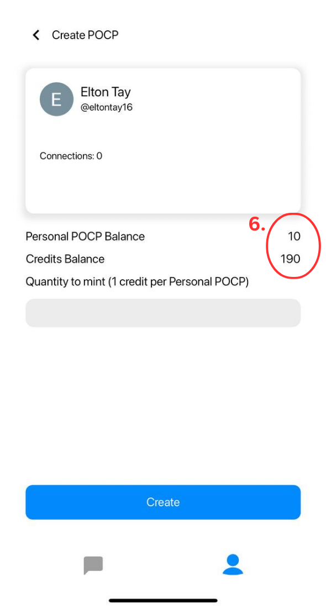

# 1. Create POCP

Chatmint enables you to craft your own identity and forge secure connections. It uses a concept called Proof Of Connection Protocol (POCP) aka your digital identity which leverages on blockchain technology. This protocol ensures data ownership, giving you control over your identity, connections and conversations while providing a secure and user-friendly environment.

**POCP** : [https://arbiscan.io/token/0xc089f89bF74aFE65f9d3746478520b6e87b665CE](https://arbiscan.io/token/0xc089f89bF74aFE65f9d3746478520b6e87b665CE)

**How to create your POCP?**

1. Open the Profile Tab and click on "Personal POCP"

<figure><figcaption></figcaption></figure>

2. Click on "Create"

<figure><figcaption></figcaption></figure>

3. Type in your specified quantity to mint&#x20;

<figure><figcaption></figcaption></figure>

4. Once done, click "Create"! It cost 1 credit per POCP and some Arbitrum ETH gas, but the team at Chatmint sponsors the gas fee for POCP creation, so that you can have a seamless experience. **Note : Due to the surge in demand, minting will be capped to one transaction per user per day.**

<figure><figcaption></figcaption></figure>

5. Click on "Confim"

<figure><figcaption></figcaption></figure>

6. Congratulations! You have officially created your POCP and now you own your identity.

<figure><figcaption></figcaption></figure>

