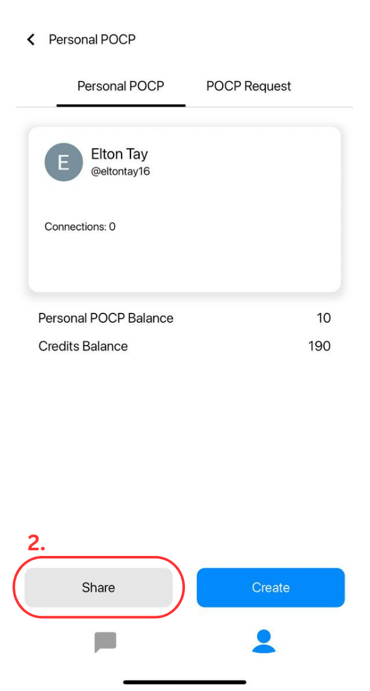

# 2. Share POCP

After creating your POCP, exchange your POCP with people you trust. This is your key in building a trusted network within Chatmint. Once POCPs are exchanged, you and your contacts are established as 1st-degree connections, enabling you to chat with one another securely.

**POCP** : [https://arbiscan.io/token/0xc089f89bF74aFE65f9d3746478520b6e87b665CE](https://arbiscan.io/token/0xc089f89bF74aFE65f9d3746478520b6e87b665CE)

**How to share your POCP?**

1. Open the Profile Tab and click on "Personal POCP"

<figure><figcaption></figcaption></figure>

2. Click on "Share"

<figure><figcaption></figcaption></figure>

3. Make sure that you have enough Arbitrum ETH  in your wallet. You can top up the balance by sending Arbitrum ETH to your wallet. **Note : Make sure to send ETH on the Arbitrum One Network , here is a guide to ensure your wallet is on the Arbitrum Network (**[**https://academy.binance.com/en/articles/how-to-add-arbitrum-to-metamask**](https://academy.binance.com/en/articles/how-to-add-arbitrum-to-metamask)**)**

<figure><figcaption></figcaption></figure>

4. Once you have topped up your wallet, make sure your other balances are also > 0, then you are good to go! The reason why you require Arbitrum ETH is because every transaction requires a little bit of gas fees. Don't worry its not a lot! Once done, click on "Select"

<figure><figcaption></figcaption></figure>

5. Choose your user you want to send your POCP to by either searching or scrolling, then click "Next"

<figure><figcaption></figcaption></figure>

5. Once you have selected your user, click on "Share"

<figure><figcaption></figcaption></figure>

7. Click on "Confirm"

<figure><figcaption></figcaption></figure>

8. Congratulations! You have successfully shared your POCP! The balance for Arbitrum ETH will take a few seconds before it is updated.

<figure><figcaption></figcaption></figure>

10. Once the other party has accepted your POCP request, you two will be considered as 2nd connections!
