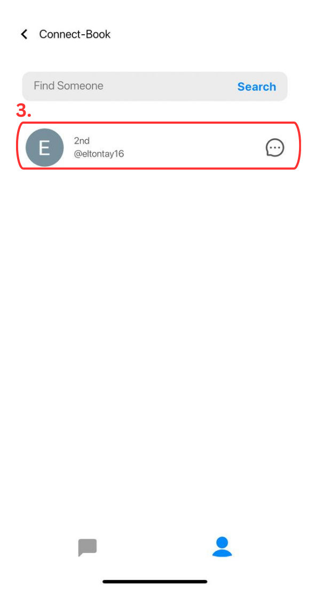
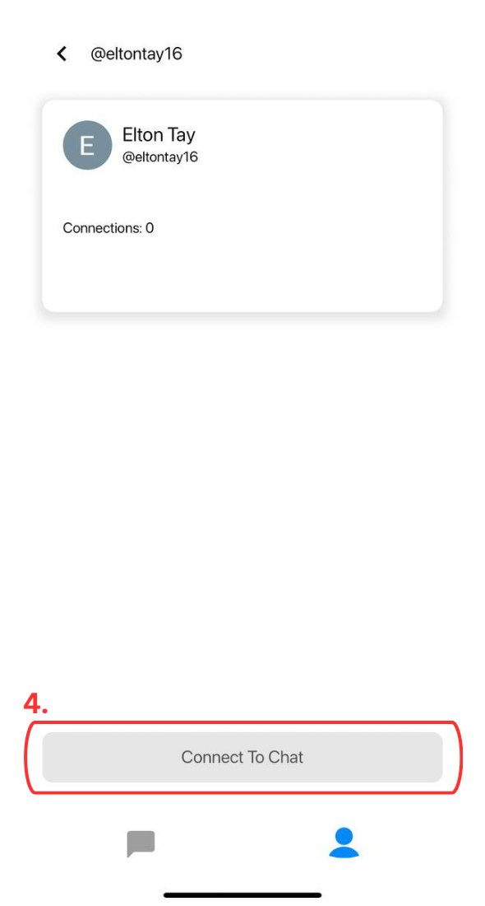
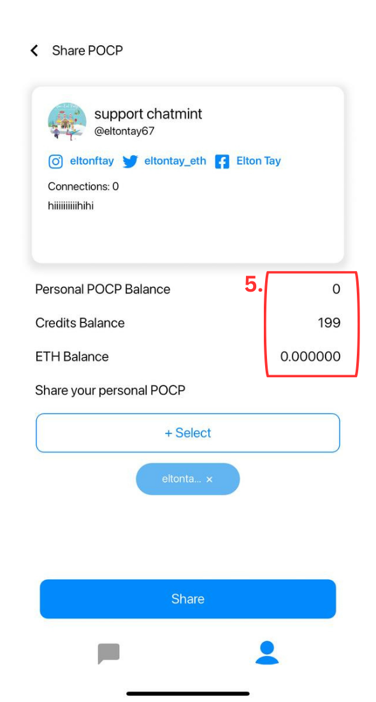
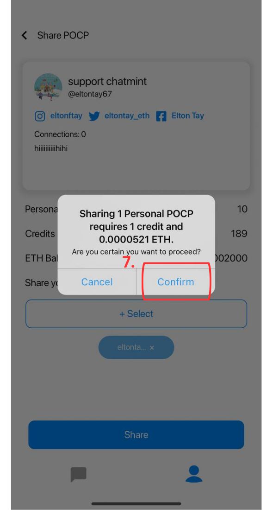
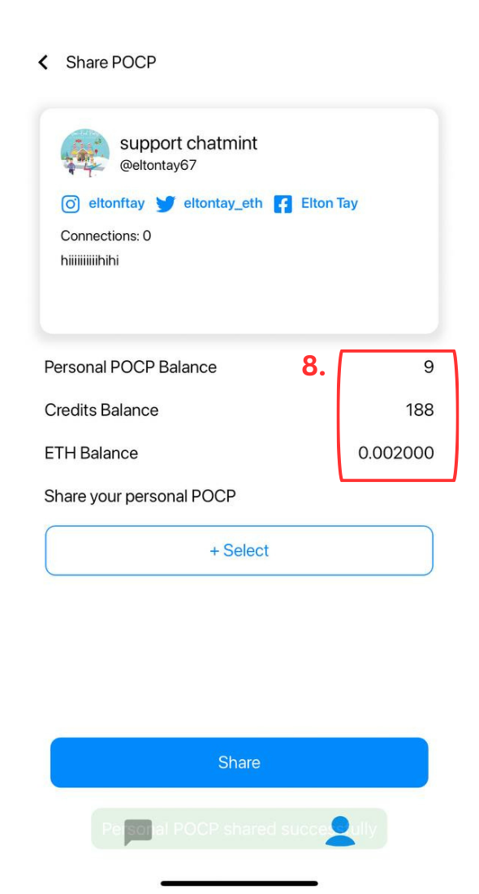
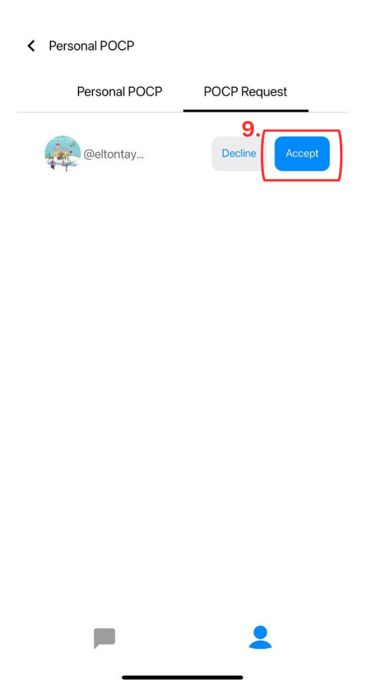
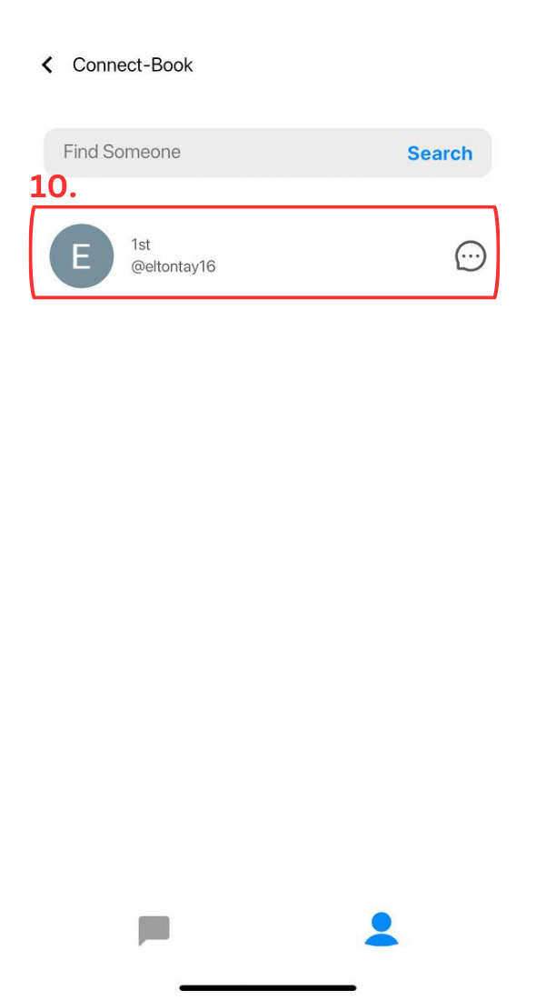
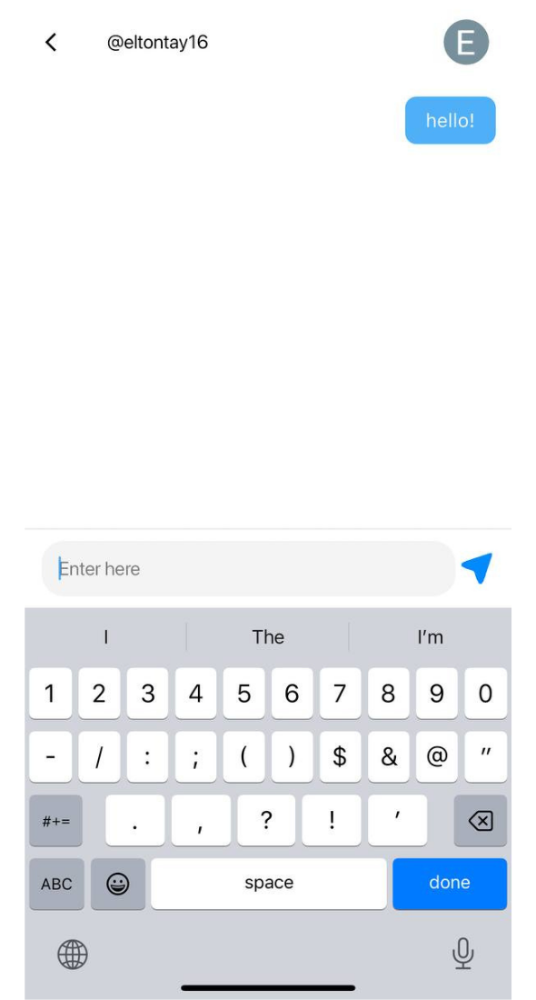

# 3. Chat Securely!

Chatmint reimagines messaging. It's not just about chats; it's about secure, interactive conversations in the digital realm. Powered by blockchain, our messaging platform ensures your privacy and security. Chat freely, knowing your data is protected. Engage in dynamic conversations, share ideas, and explore limitless possibilities while maintaining full control over your digital interactions.

**POCP** : [https://arbiscan.io/token/0xc089f89bF74aFE65f9d3746478520b6e87b665CE](https://arbiscan.io/token/0xc089f89bF74aFE65f9d3746478520b6e87b665CE)

**How to chat?**

Both parties need to exchange and accept each others' POCP before both are allowed to chat!

1. Open the Profile Tab and click on "Personal POCP"&#x20;

<figure><figcaption></figcaption></figure>

2. Click on "POCP request" and "Accept"

<figure><figcaption></figcaption></figure>

3. Go to "Connect Book" and click into your new connection

<figure><figcaption></figcaption></figure>

4. Click on "Connect to Chat"

<figure><figcaption></figcaption></figure>

5. Like before, make sure you have sufficient balance in your account!

<figure><figcaption></figcaption></figure>

6. Once you have topped up your account, you are good to go. Click on "Share"

<figure><figcaption></figcaption></figure>

7. Click "Confirm"

8. Congratulations! You have successfully shared your POCP to your 2nd connection.

<figure><figcaption></figcaption></figure>

9. Probe your sender to accept the POCP request

<figure><figcaption></figcaption></figure>

10. Woohoo! You two are now 1st connections and are able to chat!

<figure><figcaption></figcaption></figure>

11. Enjoy secure and private messaging powered by XMTP :)

<figure><figcaption></figcaption></figure>

