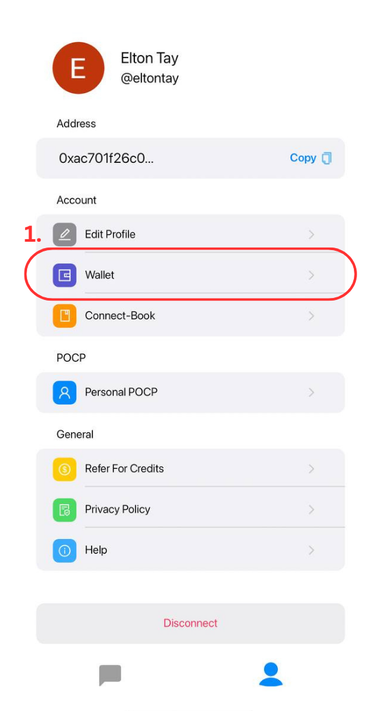
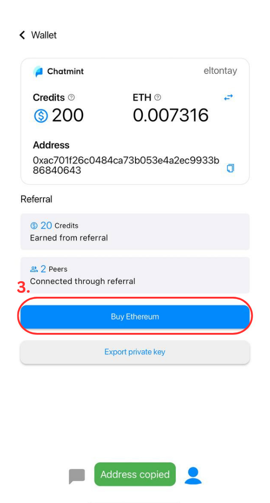
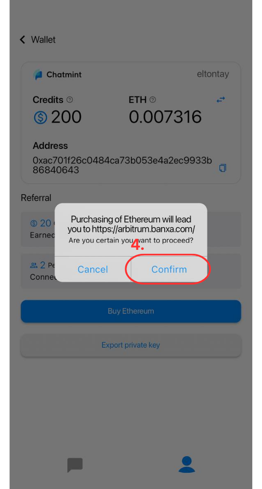
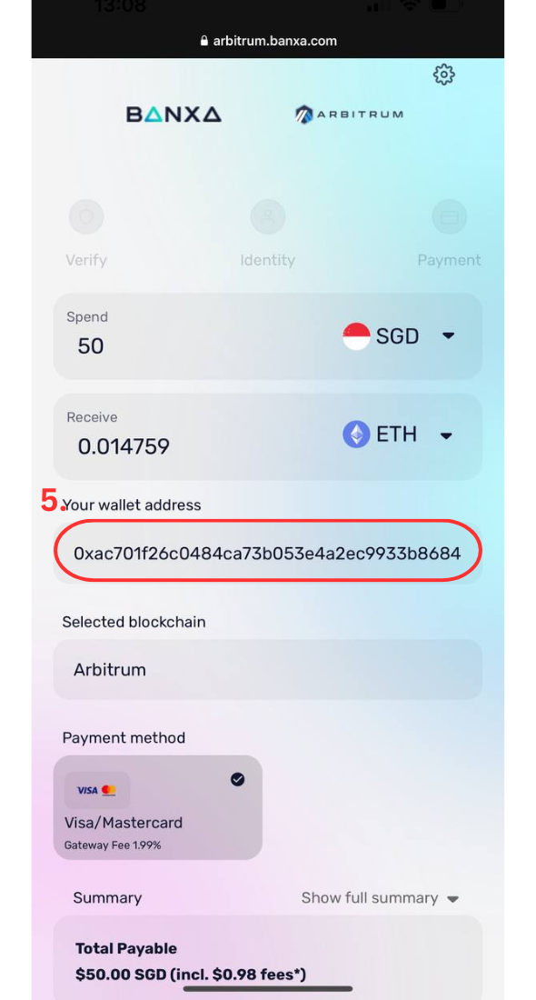

# Buy Ethereum

Chatmint has integrated [Banxa](https://arbitrum.banxa.com/) to provide you seamless onboarding of crypto. This is useful for topping up Ethereum on the Arbitrum One network to perform transactions on Chatmint.

**How to top up Ethereum?**

1. Open the Profile Tab and click on "Wallet"

<figure><figcaption></figcaption></figure>

2. Copy your wallet address by clicking on the copy icon on the right

.png>)&#x20;

3. Once copied, click on "Buy Ethereum". This would redirect you out of Chatmint to [https://arbitrum.banxa.com/](https://arbitrum.banxa.com/) to purchase crypto easily.

<figure><figcaption></figcaption></figure>

4. Click on "Confirm" for the redirection to happen.

<figure><figcaption></figcaption></figure>

5. Paste your copied address in the wallet field. Adjust the currencies respectively to your native fiat currency and the crypto of your choice. In my case, it would be SGD and ETH so I can top up straight into my wallet. Once done, follow through the steps and you would have your respective crypto in no time!

<figure><figcaption></figcaption></figure>

